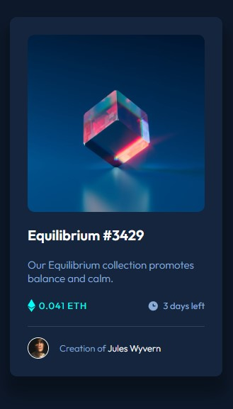

# Frontend Mentor - NFT preview card component solution

This is a solution to the [NFT preview card component challenge on Frontend Mentor](https://www.frontendmentor.io/challenges/nft-preview-card-component-SbdUL_w0U). Frontend Mentor challenges help you improve your coding skills by building realistic projects.

## Table of contents

- [Overview](#overview)
  - [The challenge](#the-challenge)
  - [Screenshot](#screenshot)
  - [Links](#links)
- [My process](#my-process)
  - [Built with](#built-with)
  - [What I learned](#what-i-learned)
  - [Useful resources](#useful-resources)
- [Author](#author)

## Overview

### The challenge

Users should be able to:

- View the optimal layout depending on their device's screen size
- See hover states for interactive elements

### Screenshot



### Links

- Solution URL: [Frontend Mentor](https://www.frontendmentor.io/solutions/nft-preview-card-using-css-flexbox-83wM2O13Up)
- Live Site URL: [NFT Preview Card](https://cgrkzlkn.github.io/nft-preview-card-component/)

## My process

### Built with

- Semantic HTML5 Markup
- CSS Flexbox
- CSS Custom Properties

### What I learned

Center an absolute positioned element:

```css
.card .image-container .view-icon {
  position: absolute;
  left: 0;
  right: 0;
  top: 0;
  bottom: 0;
  margin: auto;
}
```

### Useful resources

- [freeCodeCamp](https://www.freecodecamp.org/news/how-to-center-an-absolute-positioned-element/) - This article helped me to center the view icon.

## Author

- Website - [Cagri Kizilkan](https://cagrikizilkan.com)
- Frontend Mentor - [@cgrkzlkn](https://www.frontendmentor.io/profile/cgrkzlkn)
- Twitter - [@cgrkzlkn](https://www.twitter.com/cgrkzlkn)
